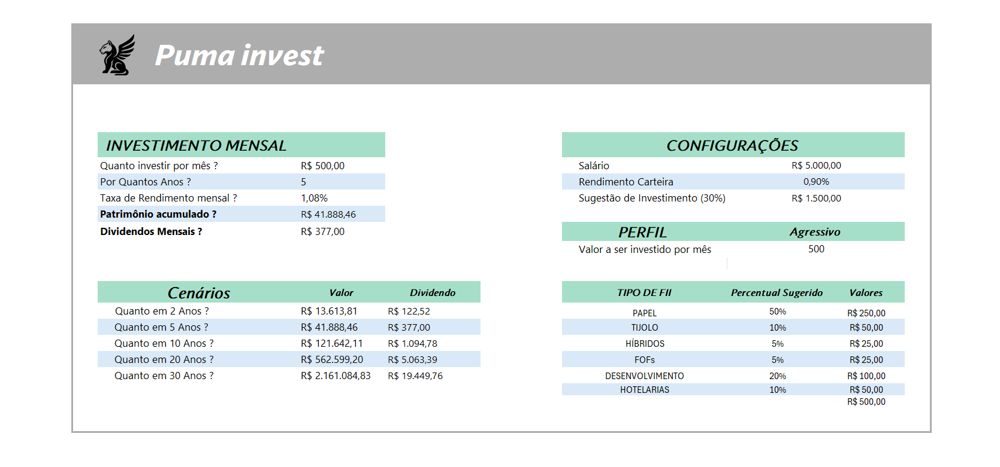

# 📊 Simulador de Investimentos em FIIs

Ferramenta em Excel para projeção de investimentos em Fundos Imobiliários, demonstrando o poder dos juros compostos na construção de patrimônio e renda passiva.

**Objetivo**: Visualizar cenários de crescimento financeiro através de simulações personalizáveis.

## ✨ Destaques

- 📈 Projeções de patrimônio acumulado
- 💰 Cálculo de rendimento passivo (dividendos)
- 🕰️ Efeito dos juros compostos ao longo do tempo
- 🎚️ Simulações customizáveis por período

## 🛠️ Funcionalidades Principais

### 📌 Painel de Entradas
- **Investimento Inicial**: Valor inicial aplicado
- **Aporte Mensal**: Contribuição recorrente
- **Rendimento Mensal**: % média de dividendos
- **Horizonte Temporal**: Período em anos

### 📌 Painel de Resultados
- **Patrimônio Total**: Valor acumulado final
- **Total Investido**: Soma dos aportes
- **Rendimentos**: Dividendos recebidos
- **Gráfico Evolutivo**: Progressão visual

## 🖼️ Demonstração

  
  
<em>Interface principal com parâmetros e resultados</em>

## 📥 Como Utilizar
1. Preencha os 4 campos básicos no painel amarelo
2. Visualize automaticamente os resultados:
   - Totais na seção azul
   - Projeção gráfica na parte inferior
3. Ajuste os valores para comparar cenários

## 💡 Melhorias Planejadas
- [ ] Incluir tabela de evolução ano a ano
- [ ] Adicionar cálculo de inflação
- [ ] Criar versão para outras classes de ativos
- [ ] Exportar relatório em PDF

---

*Desenvolvido como projeto do bootcamp da DIO - Análise de Dados com Excel*
