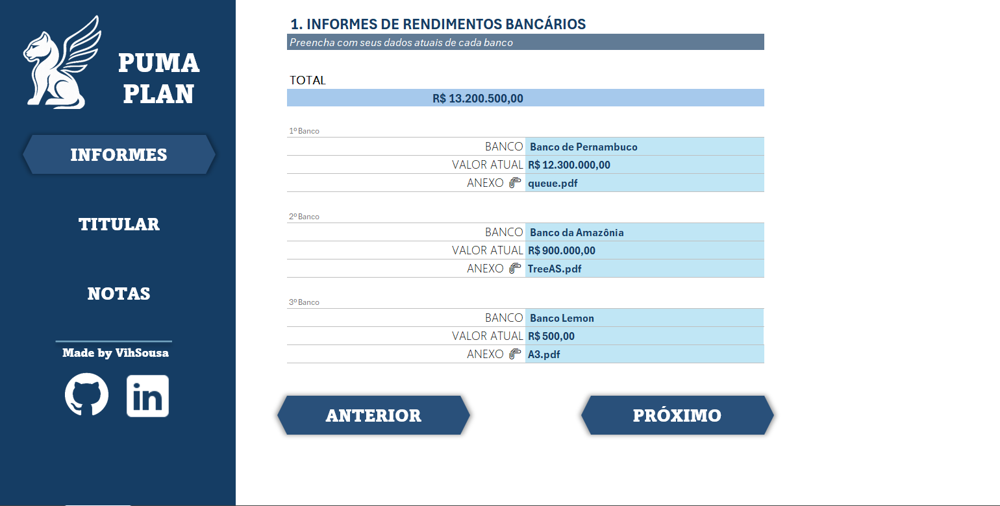
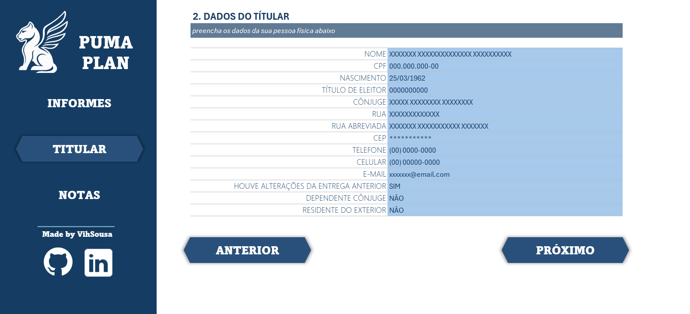
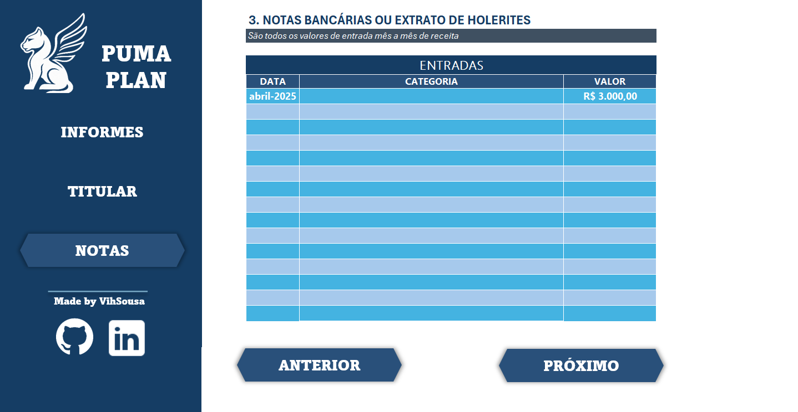

# 📊 Organizador de Declaração de Imposto de Renda (PUMA PLAN)

### 📝 Descrição do Projeto
- Desenvolvido como um desafio de projeto da DIO, esta ferramenta em Excel com uma interface interativa que ajuda a organizar e centralizar os documentos e informações para a Declaração de Imposto de Renda (IRPF). O objetivo é simplificar a coleta de dados e dar ao usuário uma visão clara de sua situação fiscal antes de preencher o programa oficial da Receita Federal.

### ⚙️ Funcionalidades Principais:
A planilha foi projetada para funcionar como uma central de informações completa, com um fluxo de navegação claro e funcionalidades específicas para cada tipo de dado:

- **Controle de Rendimentos Bancários:** A seção "Informes" permite cadastrar os saldos de diferentes contas bancárias, calcula o valor  total automaticamente e possui um campo para referenciar anexos, como os informes em PDF fornecidos pelos bancos.
- **Central de Dados Pessoais:** Na tela "Titular", o usuário pode preencher e armazenar de forma segura todos os seus dados cadastrais, como nome, CPF, endereço e informações sobre o cônjuge.
- **Registro de Entradas Mensais:** A seção "Notas" funciona como um extrato, permitindo o registro detalhado de outras fontes de receita, como salários (holerites), com data, categoria e valor.

### 📸 Capturas de Tela

**1. Tela de Informes de Rendimentos**

**2. Tela de Dados do Titular**

**3. Tela de Notas Bancárias / Holerites**
