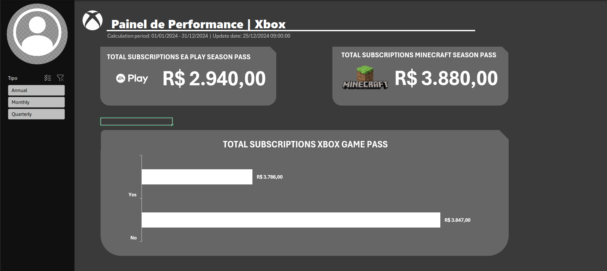

# 📊 Dashboard de Performance de Vendas | Assinaturas Xbox

Este projeto consiste em um dashboard de vendas interativo, desenvolvido no Excel, com o objetivo de analisar o desempenho de diferentes assinaturas do ecossistema Xbox. A ferramenta transforma uma base de dados bruta em um painel visual claro e intuitivo, permitindo a extração de insights e a tomada de decisões baseada em dados.

O objetivo principal é fornecer uma visão centralizada do faturamento, com foco na performance de cada tipo de assinatura e no comportamento dos usuários em relação à renovação automática.

### 🚀 Principais Funcionalidades

O dashboard foi projetado para ser uma ferramenta de análise visual, com um fluxo claro e funcionalidades específicas para explorar os dados:

- **Visão Geral com KPIs:** Apresenta os principais indicadores de faturamento em cartões de destaque (cards), como o total de vendas para o **EA Play Season Pass** e **Minecraft Season Pass**, oferecendo uma visão rápida dos resultados.
- **Análise de Renovação:** Inclui um gráfico de barras que detalha o faturamento do **Xbox Game Pass**, segmentado pela situação da autorrenovação (Sim/Não), permitindo entender o impacto dessa opção no faturamento.
- **Painel 100% Interativo:** O dashboard é totalmente dinâmico. Utilizando o filtro lateral de **Tipo de Assinatura** (Anual, Mensal, Trimestral), todos os gráficos e indicadores se atualizam automaticamente, permitindo uma análise segmentada com apenas um clique.

### 📸 Capturas de Tela

**1. Painel de Performance Final**

